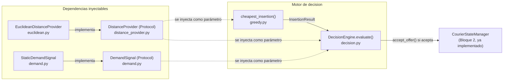

# Documentación de código — Bloque 3

Esta carpeta documenta, archivo por archivo, el código ya implementado de
Bloque 3 (Motor de Decisión). Es documentación de **cómo funciona lo que ya
existe**, no un plan — el plan general vive en `docs/Bloque 3/01_Plan.md`.

Cada doc sigue la misma estructura: propósito, pseudocódigo, desglose de
código línea por línea y explicación de sus tests.

## Índice

| Doc | Código que documenta |
|---|---|
| [`distance_provider.md`](./distance_provider.md) | `backend/core/routing/distance_provider.py` |
| [`euclidean.md`](./euclidean.md) | `backend/core/routing/euclidean.py` |
| [`greedy.md`](./greedy.md) | `backend/core/routing/greedy.py` |

> **Aviso de vigencia.** Estos tres documentan el motor VRPTW de coordenadas,
> que **ya no es el camino de decisión del sistema**. El camino que los jueces
> prueban es `api/decide.py` → `core/agent/safety.py` + `core/agent/economics.py`,
> sobre zonas enteras y tiempo absoluto. `euclidean.py` sigue vivo (alimenta la
> matriz de distancias entre zonas); `greedy.py` ya no tiene consumidor.
>
> Los docs de `decision.py` y `demand.py` se borraron con su código: describían
> archivos que ya no existen, y un documento así confunde más de lo que ayuda.
> La documentación del camino vigente está en `RESULTADOS.md`, `ENSAYO_DEMO.md`
> y los docstrings de los módulos de `core/agent/`.

## Cómo encajan estos módulos

Bloque 3 ya está completo de punta a punta (pasos 2 a 6 del plan). Las dos
primeras piezas son **dependencias inyectables** (por `Protocol`) que las
otras dos consumen sin conocer su implementación concreta:

`greedy.py` y `decision.py` reciben un `DistanceProvider` y un
`DemandSignal` como parámetros de construcción — hoy eso significa pasarles
`EuclideanDistanceProvider()` y `StaticDemandSignal()`, y el día que Bloque 5
tenga `RoadNetwork` funcionando (o alguien calcule demanda real desde el
dataset de Kaggle), el swap es cambiar qué instancia se construye en
`main.py`. Ningún código de Bloque 3 tiene que cambiar para eso — esa es la
razón de ser de los dos `Protocol`.

`decision.py` es quien orquesta todo: llama a `greedy.cheapest_insertion`
(dos veces, ver [`decision.md`](./decision.md) sección 5), consulta
`demand_signal.zone_score`, y si decide aceptar, es el único punto que
llama a `state_manager.accept_offer` (Bloque 2) — mutando el estado real
del turno.
