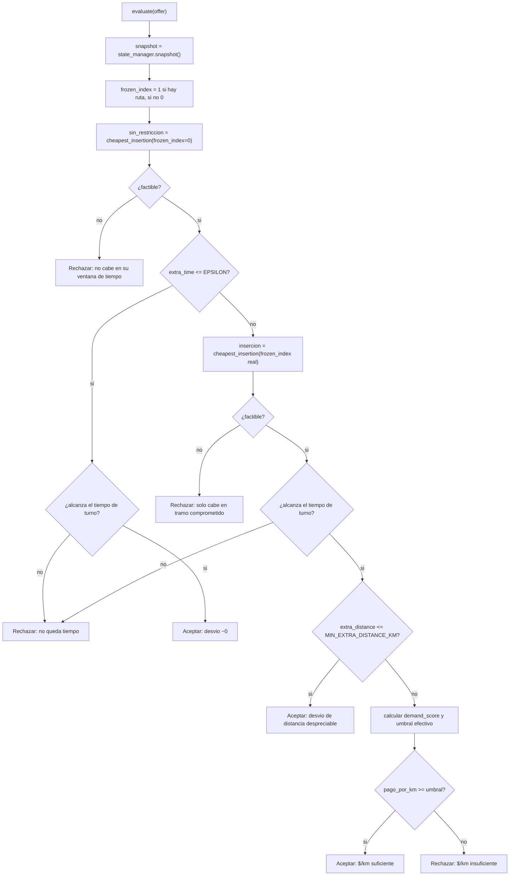

# `core/agent/decision.py` + tests

## 1. Propósito

Es el "cerebro" de Bloque 3: `DecisionEngine.evaluate(offer)` ata todo lo
demás — la heurística de inserción (`greedy.py`), la señal de demanda
(`demand.py`), el estado del courier (`state.py`, Bloque 2) y el log
explicable (`llm_log.py`) — para producir **una** decisión de
aceptar/rechazar por cada oferta que llega. Es el entregable formal de
Bloque 3 según el reparto de tareas original: "función
`decide(oferta, estado, distancias) → aceptar/rechazar + log`".

Implementa las 4 reglas de `docs/01_Arquitectura.md` sección 3 (Bloque 3) en
el orden y con las decisiones de diseño descritas en
`docs/Bloque 3/01_Plan.md` secciones 5 y 6.

## 2. Cambios respecto al stub original

El stub original solo recibía `state_manager` en el constructor. Se
agregaron, con la misma justificación que en `greedy.py`
(ver [`greedy.md`](./greedy.md) sección 2):

- **`distance_provider: DistanceProvider`** y **`demand_signal: DemandSignal`**
  como dependencias inyectadas por `Protocol` — hoy se les pasa
  `EuclideanDistanceProvider()` y `StaticDemandSignal()`.
- **`Decision` ganó un campo `log: str`** — el string ya formateado por
  `format_decision_log`, para que quien reciba una `Decision` (el loop de
  simulación, el feed del dashboard) no tenga que volver a importar
  `llm_log` ni reconstruirlo.

## 3. Las cuatro constantes del módulo

```python
MIN_PAY_PER_KM = 8.0          # umbral base, MXN/km
DEMAND_DISCOUNT = 0.3         # relajacion maxima del umbral en zona caliente
MARGINAL_TIME_EPSILON = 1.0   # minutos: "practicamente cero" para el frozen horizon
MIN_EXTRA_DISTANCE_KM = 0.05  # km: evita dividir entre ~0 al calcular $/km
```

Las cuatro están documentadas en el código como *placeholders a calibrar*
(no constantes mágicas) — es el mandato explícito de
`docs/02_Documentacion_Tecnica.md` sección 5: deben poderse defender ante el
jurado como decisiones, no como números sueltos.

## 4. Pseudocódigo del método `evaluate`

```
función evaluate(oferta):
    snapshot = state_manager.snapshot()
    ofertas_aceptadas = {o.id: o para o en snapshot.backpack}
    frozen_index = 1 si snapshot.route no esta vacia sino 0

    # Paso A: busqueda SIN restriccion de frozen horizon
    sin_restriccion = cheapest_insertion(snapshot.route, oferta, frozen_index=0, ...)

    si sin_restriccion no es factible:
        rechazar("no cabe en ninguna posicion dentro de su ventana de tiempo")

    si sin_restriccion.extra_time <= MARGINAL_TIME_EPSILON:
        si sin_restriccion.extra_time > snapshot.time_remaining:
            rechazar("no queda tiempo de turno")
        aceptar(sin_restriccion, "desvio ~0, va en la ruta")   # excepcion del frozen horizon

    # Paso B: busqueda respetando el tramo comprometido
    insercion = cheapest_insertion(snapshot.route, oferta, frozen_index=frozen_index, ...)

    si insercion no es factible:
        rechazar("solo cabe invadiendo el tramo comprometido")

    si insercion.extra_time > snapshot.time_remaining:
        rechazar("no queda tiempo de turno")

    si insercion.extra_distance <= MIN_EXTRA_DISTANCE_KM:
        aceptar(insercion, "desvio de distancia despreciable")

    demand_score = demand_signal.zone_score(oferta.pickup)
    umbral_efectivo = MIN_PAY_PER_KM * (1 - demand_score * DEMAND_DISCOUNT)
    pago_por_km = oferta.pay / insercion.extra_distance

    si pago_por_km < umbral_efectivo:
        rechazar("$/km insuficiente")
    sino:
        aceptar(insercion, "$/km suficiente")
```

## 5. Por qué dos búsquedas de inserción (`sin_restriccion` e `insercion`)

Este es el punto de diseño menos obvio del archivo, así que vale la pena
explicarlo con detalle (es exactamente el tipo de decisión que el plan
advertía que no se podía improvisar sobre la marcha, ver
`docs/Bloque 3/01_Plan.md` sección 2).

La regla de la arquitectura dice: "el tramo en tránsito no se reordena...
salvo que el costo marginal sea prácticamente cero". Es decir, la única
forma de insertar algo **antes** de `frozen_index` es que sea casi gratis.
Pero `cheapest_insertion` (por diseño, ver [`greedy.md`](./greedy.md)
sección 4) nunca busca posiciones antes de `frozen_index` que se le pase —
esa función no "permite excepciones", solo obedece el rango que se le da.

Entonces, para poder detectar la excepción, `decision.py` llama a
`cheapest_insertion` **dos veces**:

1. **`sin_restriccion` (`frozen_index=0`)**: la búsqueda completa, sin
   proteger el tramo comprometido. Sirve para dos cosas a la vez:
   - Si ni siquiera aquí hay una posición factible, tampoco la va a haber
     en la búsqueda restringida (que es un subconjunto de estas
     posiciones) — se puede rechazar de inmediato sin gastar la segunda
     búsqueda.
   - Si la mejor posición **sin restricción** ya cuesta ~0
     (`extra_time <= MARGINAL_TIME_EPSILON`), es la señal exacta de "está
     literalmente en el camino" — se acepta ahí mismo, sin importar si esa
     posición cae antes o después de `frozen_index`. Esto generaliza
     ligeramente la regla original (que la enuncia solo para el caso
     "dentro del tramo comprometido"), pero es una generalización segura:
     cualquier inserción casi gratis es, por definición, "ir en camino".
2. **`insercion` (`frozen_index` real)**: solo se calcula si la excepción
   del paso 1 no aplicó. Es la búsqueda que de verdad respeta el tramo
   comprometido, y sobre la que se evalúan las reglas normales de umbral.

El costo de este diseño es hacer, en el peor caso, el doble de trabajo
(dos búsquedas O(n) en vez de una) — aceptable para el volumen de una
demo de hackathon, y documentado aquí explícitamente para que quien lo lea
después no lo confunda con una llamada redundante por descuido.

## 6. Desglose del resto del método

```python
if unrestricted.extra_time <= MARGINAL_TIME_EPSILON:
    if unrestricted.extra_time > snapshot.time_remaining:
        return self._reject(...)
    return self._accept(offer, unrestricted, ...)
```
Incluso en el caso "casi gratis" se verifica el tiempo restante del turno:
si quedan 0.5 minutos de turno y el desvío (aunque mínimo) es de 0.8, no
alcanza — un desvío "prácticamente cero" no es lo mismo que "cero".

```python
if insertion.extra_distance <= MIN_EXTRA_DISTANCE_KM:
    reason = f"desvio de distancia despreciable ({insertion.extra_distance:.2f} km)"
    return self._accept(offer, insertion, reason)
```
Evita dividir entre un número casi cero al calcular `pago_por_km` más
abajo — sin este corte, un desvío de distancia de `0.0001 km` podría
producir un `$/km` artificialmente enorme (o un `ZeroDivisionError` exacto
si el desvío fuera `0.0` sin haber calificado para la excepción de tiempo
del paso anterior, algo posible en teoría si el proveedor de distancias
reporta tiempo y distancia con precisiones distintas).

```python
demand_score = self.demand_signal.zone_score(offer.pickup)
min_pay_per_km = MIN_PAY_PER_KM * (1 - demand_score * DEMAND_DISCOUNT)
pay_per_km = offer.pay / insertion.extra_distance
```
El umbral de aceptación no es fijo: en la zona de demanda más caliente
(`demand_score=1.0`) se relaja hasta un `DEMAND_DISCOUNT` (30% por defecto)
respecto al mínimo base. Se usa `offer.pickup` (no `dropoff`) para leer la
zona — la intuición es "esta oferta viene de una zona caliente, aceptarla
aunque pague un poco menos ahora abre la puerta a más ofertas de la misma
zona después" (extensión de posicionamiento proactivo mencionada en
`docs/02_Documentacion_Tecnica.md` sección 6).

```python
def _accept(self, offer, insertion, reason):
    self.state_manager.accept_offer(offer, insertion.new_route)
    log = format_decision_log(True, offer.id, reason)
    return Decision(accepted=True, offer=offer, reason=reason, new_route=insertion.new_route, log=log)
```
`_accept` es el único lugar del archivo que muta el estado
(`state_manager.accept_offer`) — todas las reglas de arriba solo deciden
*si* se llega a este punto, nunca mutan nada por sí mismas. Esto hace fácil
verificar en los tests que un rechazo nunca deja rastro en el estado.

## 7. Flujo completo



## 8. Tests (`tests/test_decision.py`)

| Test | Qué verifica | Por qué importa |
|---|---|---|
| `test_accepts_clearly_profitable_offer` | Oferta claramente rentable se acepta, muta el estado (`version`, `earnings`, `backpack`) y el log dice "Aceptado" | Camino feliz básico, de punta a punta |
| `test_rejects_when_pay_per_km_is_below_minimum` | Oferta lejana y mal pagada se rechaza sin tocar el estado | Verifica la regla de umbral y que un rechazo no muta nada |
| `test_rejects_when_not_enough_shift_time_remaining` | Con `shift_duration=5.0`, una oferta muy rentable pero de ~54 min se rechaza igual | Verifica que la factibilidad de tiempo de turno gana sobre el pago, sin importar qué tan bueno sea |
| `test_accepts_by_marginal_zero_exception_even_with_low_pay` | Una segunda oferta que recoge/entrega exactamente donde termina la primera se acepta con `pay=1.0` | Verifica el mecanismo de las "dos búsquedas" (sección 5) con un caso realista, no solo `pickup == dropoff` en el vacío |
| `test_demand_signal_relaxes_the_threshold` | La misma oferta ($/km ≈ 6.0) se rechaza con `demand_score=0.0` y se acepta con `demand_score=1.0` | Verifica que la señal de demanda de verdad mueve la decisión, con un `FakeDemandSignal` de prueba en vez de `StaticDemandSignal` |

### `tests/test_decision_integration.py` — smoke test sin mocks

A diferencia de los tests anteriores (que usan un `FakeDemandSignal` para
control total), este test instancia `SimulationEngine` (Bloque 1) y
`CourierStateManager` (Bloque 2) **reales** — sin ningún doble de prueba — y
corre un turno completo evaluando cada `Offer` que produce el generador
sintético. Verifica invariantes de extremo a extremo (la versión del estado
nunca retrocede; las ganancias solo suben cuando el log dice "Aceptado") en
vez de resultados exactos, porque el stream de eventos es determinista por
seed pero no diseñado a mano como los demás tests. Existe porque Bloque 1 y
Bloque 2 ya son código real hoy (ver `docs/Bloque 3/01_Plan.md` sección 0),
no solo mocks hipotéticos — es la primera vez que Bloque 3 se prueba contra
el resto del sistema tal como va a correr en la demo.
