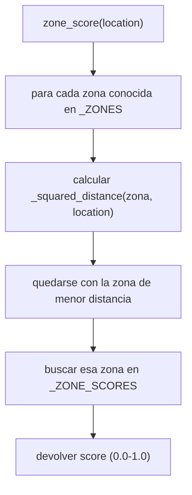

# `core/agent/demand.py` + `tests/test_demand.py`

## 1. Propósito

Define la **señal de demanda histórica de la zona** que pide el reparto de
tareas para la evaluación de umbral de Bloque 3 ("comparar ese costo contra
el pago ofrecido, el tiempo restante del turno y la señal de demanda
histórica de la zona"), a pesar de que ningún bloque produce esa señal
todavía: `Offer` (en `core/models.py`) no trae campo de zona/demanda, y
`data/kaggle_orders.csv` (el dataset real, dueño natural: Bloque 1) no existe
en el repo (`data/README.md` lo marca como descarga manual pendiente).

`StaticDemandSignal` es el default para no bloquear el resto del motor de
decisión mientras esa pregunta de dueño se resuelve con el equipo (ver
`docs/Bloque 3/01_Plan.md` sección 7).

## 2. Decisión de diseño: `Protocol` + implementación intercambiable

Mismo patrón que `DistanceProvider` (ver
[`distance_provider.md`](./distance_provider.md)): `decision.py` va a recibir
un `DemandSignal` como parámetro sin saber si por dentro hay una tabla fija
de 4 zonas (hoy) o un modelo entrenado sobre el dataset real de Kaggle
(extensión posible, ver `docs/02_Documentacion_Tecnica.md` sección 6). El
día que exista la versión real, el cambio es una línea en `main.py`, no en
`decision.py`.

## 3. Pseudocódigo

```
interfaz DemandSignal:
    función zone_score(ubicación: (lat, lon)) -> número entre 0.0 y 1.0

ZONAS = {
    "Tec":       (25.651, -100.289),
    "San Pedro": (25.657, -100.402),
    "Centro":    (25.680, -100.310),
    "Apodaca":   (25.780, -100.180),
}

SCORES_POR_ZONA = {
    "Centro":    0.9,
    "Tec":       0.7,
    "San Pedro": 0.5,
    "Apodaca":   0.3,
}

clase StaticDemandSignal implementa DemandSignal:
    función zone_score(ubicación):
        zona_mas_cercana = la zona en ZONAS con menor distancia_al_cuadrado(ubicación)
        devolver SCORES_POR_ZONA[zona_mas_cercana]
```

## 4. Desglose de código

```python
from typing import Protocol


class DemandSignal(Protocol):
    def zone_score(self, location: tuple[float, float]) -> float:
        """Score de demanda historica de la zona a la que pertenece `location`.

        Rango 0.0 (zona fria) - 1.0 (zona caliente).
        """
        ...
```
- Mismo patrón que `DistanceProvider`: interfaz de un solo método, sin
  estado, sin herencia obligatoria para quien la implemente.
- El rango `0.0`–`1.0` es una convención documentada en el docstring — la
  hace explícita para que quien construya `decision.py` (o el dashboard de
  Bloque 6, si llega a mostrar este score) sepa qué esperar sin tener que
  leer `StaticDemandSignal`.

```python
_ZONES: dict[str, tuple[float, float]] = {
    "Tec": (25.651, -100.289),
    "San Pedro": (25.657, -100.402),
    "Centro": (25.680, -100.310),
    "Apodaca": (25.780, -100.180),
}
```
- Deliberadamente **copia exacta** de las coordenadas de
  `SimulationEngine._zones` (Bloque 1) — no una lista independiente. Esto es
  a propósito: como hoy `engine.py` elige `pickup`/`dropoff` de una oferta
  exactamente entre estas 4 coordenadas, cualquier oferta real del sistema
  va a coincidir exacto con una de estas zonas. Si Persona A cambia estas
  coordenadas, hay que actualizarlas aquí — es la única duplicación en todo
  el módulo, señalada explícitamente en el comentario del código.

```python
_ZONE_SCORES: dict[str, float] = {
    "Centro": 0.9,
    "Tec": 0.7,
    "San Pedro": 0.5,
    "Apodaca": 0.3,
}
```
- Valores **arbitrarios** (Centro y Tec más "calientes" por densidad urbana
  esperada, Apodaca más "fría" por ser zona industrial) — no vienen de datos
  reales todavía. Documentados en el código como placeholder a calibrar en
  la Fase 4 del cronograma, con la misma justificación que
  `MIN_PAY_PER_KM` en `decision.py` (evitar que sean "constantes mágicas" no
  defendibles ante el jurado).

```python
def _squared_distance(a: tuple[float, float], b: tuple[float, float]) -> float:
    return (a[0] - b[0]) ** 2 + (a[1] - b[1]) ** 2
```
- Distancia euclidiana **al cuadrado**, no haversine — a propósito no
  reutiliza `_haversine_km` de `euclidean.py`. Aquí no importa la distancia
  real en km, solo **cuál** zona está más cerca (un ranking), y elevar al
  cuadrado evita la raíz cuadrada (innecesaria para comparar magnitudes) sin
  perder precisión en el resultado del `min(...)`. También evita acoplar
  `core/agent` a un detalle privado de `core/routing`.

```python
class StaticDemandSignal:
    def zone_score(self, location: tuple[float, float]) -> float:
        nearest_zone = min(_ZONES, key=lambda name: _squared_distance(_ZONES[name], location))
        return _ZONE_SCORES[nearest_zone]
```
- `min(_ZONES, key=...)` itera sobre las **claves** del diccionario
  (`"Tec"`, `"San Pedro"`, ...) y se queda con la que minimiza la distancia
  al cuadrado contra `location` — es decir, "la zona conocida más cercana".
- Por qué "zona más cercana" y no "coincidencia exacta": hoy toda oferta de
  `engine.py` cae exacto en una de las 4 zonas, pero el día que Bloque 1
  use el dataset real de Kaggle, las coordenadas van a ser arbitrarias
  (direcciones reales, no los 4 puntos fijos) — con nearest-zone, el stub
  sigue funcionando razonablemente sin cambiar código, solo perdiendo
  precisión (una simplificación explícita, no un bug latente).

## 5. Flujo de una llamada



## 6. Tests (`tests/test_demand.py`)

| Test | Qué verifica | Por qué importa |
|---|---|---|
| `test_known_zones_return_score_in_valid_range` | Las 4 zonas conocidas devuelven un score dentro de `[0.0, 1.0]` | Garantiza que la convención documentada en `DemandSignal.zone_score` se cumple, no solo se declara en el docstring |
| `test_centro_is_hotter_than_apodaca` | `zone_score(Centro) > zone_score(Apodaca)` | Fija la intención de diseño (Centro es zona caliente) como comportamiento verificable, no solo un comentario |
| `test_nearby_point_snaps_to_nearest_known_zone` | Un punto a ~150 m de Centro (no exacto) da el mismo score que Centro | Verifica el caso que justifica usar "zona más cercana" en vez de comparación exacta — importante de cara a cuando lleguen coordenadas reales del dataset |
| `test_score_is_deterministic` | Llamar dos veces con la misma ubicación da el mismo resultado | `StaticDemandSignal` no tiene estado mutable ni aleatoriedad; este test lo deja explícito para que quien lo cambie después no rompa esa garantía sin darse cuenta |
