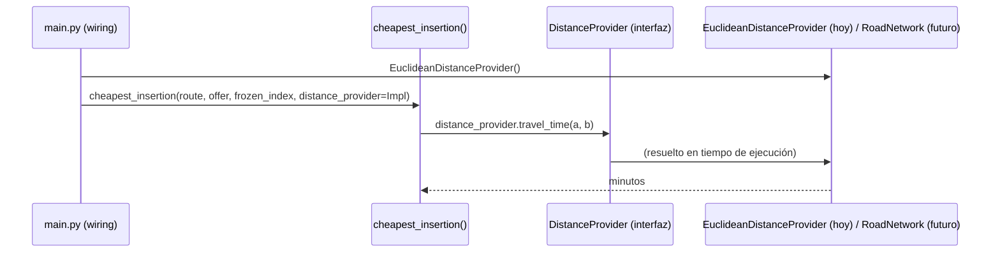

# `core/routing/distance_provider.py`

## 1. Propósito

Define el **contrato** que cualquier fuente de distancias/tiempos debe
cumplir para que `greedy.py` y `decision.py` (Bloque 3) puedan usarla sin
saber si detrás hay una línea recta (placeholder) o el grafo vial real de
Monterrey (Bloque 5, `graph.py`, todavía sin implementar).

Es el mecanismo que permite cumplir el requisito del reparto de tareas:
> "Depende de: la interfaz de distancias del Bloque 5 (puede arrancar con
> distancias euclidianas de placeholder mientras Persona C termina el grafo
> real)."

Ver también `docs/Bloque 3/01_Plan.md` sección 3, donde se justifica esta
decisión de diseño (inversión de dependencias).

## 2. Por qué un `Protocol` y no una clase base (`ABC`)

Un `Protocol` de `typing` define **tipado estructural**: cualquier clase que
tenga métodos con esos nombres y esas firmas lo satisface automáticamente,
sin necesidad de heredar de nada ni de importar `distance_provider.py` en
`euclidean.py` o en `graph.py`. Esto es justo lo que se necesita aquí:
`EuclideanDistanceProvider` (esta tarea) y, más adelante, `RoadNetwork`
(Bloque 5) pueden vivir en módulos completamente independientes y aun así
ser intercambiables donde se pida un `DistanceProvider`.

Si fuera una clase abstracta (`ABC`), `RoadNetwork` tendría que heredar
explícitamente de ella — acoplando Bloque 5 a un archivo de Bloque 3 solo
para satisfacer el tipo. Con `Protocol` no hace falta ese acoplamiento.

## 3. Pseudocódigo

```
interfaz DistanceProvider:
    función travel_time(origen: (lat, lon), destino: (lat, lon)) -> minutos
    función travel_distance(origen: (lat, lon), destino: (lat, lon)) -> kilómetros
```

Dos métodos, no uno, porque Bloque 3 necesita ambas unidades por separado:
- `travel_time` → para la regla "cabe en el tiempo restante del turno" y
  para el costo marginal de la heurística de inserción (sección 4 del plan).
- `travel_distance` → para la regla de umbral `$/km` (`MIN_PAY_PER_KM` en
  `decision.py`).

## 4. Desglose de código

```python
from typing import Protocol


class DistanceProvider(Protocol):
    def travel_time(self, origin: tuple[float, float], destination: tuple[float, float]) -> float:
        """Tiempo de viaje estimado entre dos coordenadas, en minutos."""
        ...

    def travel_distance(self, origin: tuple[float, float], destination: tuple[float, float]) -> float:
        """Distancia estimada entre dos coordenadas, en kilometros."""
        ...
```

- **`class DistanceProvider(Protocol)`** — hereda de `Protocol`, lo que le
  dice a `mypy`/al lector que esto es una interfaz, no una implementación.
  No tiene `__init__` ni estado: solo firmas de método.
- **`origin`/`destination`: `tuple[float, float]`** — mismo formato que
  `Offer.pickup`/`Offer.dropoff` en `core/models.py` (latitud, longitud),
  para no necesitar conversión al llamar desde `greedy.py`.
- **Cuerpo `...`** — un `Protocol` no implementa nada; el `...` es literal
  Python válido (`Ellipsis`) usado por convención para marcar "sin cuerpo,
  solo firma".
- **Sin `@abstractmethod`** — no hace falta; `Protocol` ya impide instanciar
  la interfaz directamente sin que ningún método esté implementado por quien
  la satisface.

## 5. Flujo de uso (previsto para el paso 4)



`greedy.py` nunca importa `EuclideanDistanceProvider` ni `RoadNetwork` — solo
declara que su parámetro es de tipo `DistanceProvider`. Quien decide qué
implementación concreta usar es el código de arranque (`main.py`), no
Bloque 3.

## 6. Tests

Este archivo no tiene tests propios (una interfaz sin cuerpo no tiene
comportamiento que probar). Se verifica indirectamente: los tests de
`euclidean.py` (ver [`euclidean.md`](./euclidean.md)) comprueban que
`EuclideanDistanceProvider` cumple el contrato al usarlo como si fuera un
`DistanceProvider` cualquiera.
