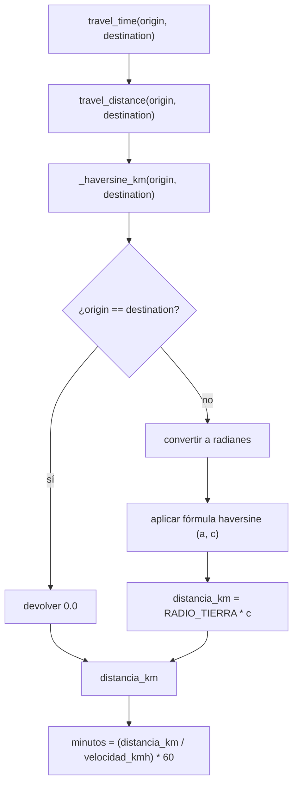

# `core/routing/euclidean.py` + `tests/test_euclidean.py`

## 1. Propósito

Implementación **placeholder** de `DistanceProvider` (ver
[`distance_provider.md`](./distance_provider.md)) que no depende del grafo
vial real de Monterrey — calcula distancia en línea recta (fórmula
haversine, que sí toma en cuenta la curvatura de la Tierra, a diferencia de
un euclidiano plano) y convierte esa distancia a tiempo asumiendo una
velocidad promedio fija.

Existe porque Bloque 5 (`core/routing/graph.py`) sigue sin implementar
`shortest_path_time`/`apply_road_event` (confirmado al revisar el repo, ver
`docs/Bloque 3/01_Plan.md` sección 0) — sin este placeholder, Bloque 3 no
podría avanzar hasta que Persona C termine su parte.

## 2. Conceptos: ¿por qué haversine y no una resta simple de coordenadas?

Latitud y longitud son grados sobre una esfera, no un plano cartesiano: un
grado de longitud mide menos distancia real mientras más lejos del ecuador
estás, y la Tierra es curva. Restar coordenadas directamente
(`√(Δlat² + Δlon²)`) da un número sin unidad física clara y se distorsiona
según la latitud. La fórmula **haversine** convierte la diferencia angular
entre dos puntos de la esfera en una distancia real (en km), usando el radio
de la Tierra.

Para el propósito de Bloque 3 (comparar costos marginales dentro de la
misma ciudad, Monterrey) un plano local sería casi igual de preciso, pero
haversine es barato de calcular y evita tener que justificar la
aproximación — es la elección "correcta por defecto" para no tener que
revisarla después.

## 3. Pseudocódigo

### `_haversine_km(origen, destino)`

```
función haversine_km(origen, destino):
    (lat1, lon1) = origen
    (lat2, lon2) = destino

    si origen == destino:
        devolver 0.0                      # atajo: evita error de precisión de punto flotante

    convertir lat1, lat2, Δlat, Δlon a radianes

    a = sin²(Δlat / 2) + cos(lat1) * cos(lat2) * sin²(Δlon / 2)
    c = 2 * atan2(√a, √(1 - a))

    devolver RADIO_TIERRA_KM * c
```

### `EuclideanDistanceProvider`

```
clase EuclideanDistanceProvider:
    constructor(velocidad_promedio_kmh = 20.0):
        guardar velocidad_promedio_kmh

    función travel_distance(origen, destino):
        devolver haversine_km(origen, destino)

    función travel_time(origen, destino):
        distancia_km = travel_distance(origen, destino)
        devolver (distancia_km / velocidad_promedio_kmh) * 60   # horas -> minutos
```

## 4. Desglose de código

```python
EARTH_RADIUS_KM = 6371.0
AVG_SPEED_KMH = 20.0
```
- `EARTH_RADIUS_KM` — radio medio de la Tierra, constante estándar de la
  fórmula haversine (no es un parámetro a calibrar, es geometría).
- `AVG_SPEED_KMH = 20.0` — **sí** es un parámetro a calibrar: velocidad
  promedio asumida para un repartidor urbano en Monterrey (tráfico, semáforos,
  etc. incluidos implícitamente en el promedio). Documentado explícitamente
  como placeholder en el propio código, siguiendo la regla del plan de no
  dejar constantes mágicas sin justificar.

```python
def _haversine_km(origin, destination):
    lat1, lon1 = origin
    lat2, lon2 = destination

    if lat1 == lat2 and lon1 == lon2:
        return 0.0
```
- Función privada (prefijo `_`), de módulo — no forma parte de la interfaz
  pública, es un detalle de implementación de `EuclideanDistanceProvider`.
- El atajo de igualdad exacta evita que, por error de redondeo de punto
  flotante, `asin`/`atan2` de un valor ligerísimamente distinto de cero
  cuando en realidad el mismo punto debería dar exactamente `0.0` (esto es lo
  que verifica `test_distance_is_zero_for_same_point`).

```python
    phi1, phi2 = math.radians(lat1), math.radians(lat2)
    d_phi = math.radians(lat2 - lat1)
    d_lambda = math.radians(lon2 - lon1)

    a = math.sin(d_phi / 2) ** 2 + math.cos(phi1) * math.cos(phi2) * math.sin(d_lambda / 2) ** 2
    c = 2 * math.atan2(math.sqrt(a), math.sqrt(1 - a))

    return EARTH_RADIUS_KM * c
```
- `phi1`/`phi2` (φ) son las latitudes en radianes — notación estándar de la
  fórmula haversine (viene de trigonometría esférica).
- `d_phi`/`d_lambda` son las diferencias de latitud/longitud en radianes.
- `a` es la fórmula haversine propiamente ("mitad del ángulo central,
  elevado al cuadrado"); `c` es el ángulo central resultante en radianes.
- `EARTH_RADIUS_KM * c` — un ángulo en radianes multiplicado por el radio da
  el arco (distancia) recorrido sobre la esfera, en las mismas unidades del
  radio (km).

```python
class EuclideanDistanceProvider:
    def __init__(self, avg_speed_kmh: float = AVG_SPEED_KMH) -> None:
        self.avg_speed_kmh = avg_speed_kmh

    def travel_distance(self, origin, destination) -> float:
        return _haversine_km(origin, destination)

    def travel_time(self, origin, destination) -> float:
        distance_km = self.travel_distance(origin, destination)
        return (distance_km / self.avg_speed_kmh) * 60.0
```
- `avg_speed_kmh` es parámetro del constructor (no una constante de módulo
  fija) para poder ajustarlo en tests o en calibración sin tocar el código —
  ver `test_travel_time_scales_with_speed`.
- `travel_time` reutiliza `travel_distance` (no duplica la llamada a
  `_haversine_km`) y convierte horas a minutos multiplicando por 60, porque
  todo el sistema usa minutos como unidad de tiempo (`shift_duration=480.0`
  en los tests de Bloque 2 = 8 horas en minutos).
- Esta clase **satisface** `DistanceProvider` (ver
  [`distance_provider.md`](./distance_provider.md)) solo por tener estos dos
  métodos con estas firmas — no hay ninguna línea que declare la relación
  explícitamente, es tipado estructural.

## 5. Flujo de una llamada



## 6. Tests (`tests/test_euclidean.py`)

| Test | Qué verifica | Por qué importa |
|---|---|---|
| `test_distance_is_zero_for_same_point` | `travel_distance`/`travel_time` dan `0.0` exacto entre un punto y sí mismo | Sin el atajo de igualdad en `_haversine_km`, esto podría dar un número casi-cero pero no exacto por precisión de punto flotante |
| `test_distance_is_symmetric` | `distancia(A, B) == distancia(B, A)` | La heurística de inserción recorre la ruta en ambas direcciones; una asimetría rompería el cálculo de costo marginal |
| `test_distance_is_reasonable_for_monterrey_zones` | La distancia Tec↔San Pedro cae en un rango realista (5–25 km) | Detecta errores de unidades (ej. confundir metros con km, o radianes con grados) con un caso concreto de la ciudad real |
| `test_travel_time_scales_with_speed` | A la mitad de velocidad, el doble de tiempo, para el mismo par de puntos | Verifica la relación inversa distancia/velocidad de `travel_time` sin depender de un valor exacto hardcodeado |

Las coordenadas de prueba (`TEC`, `SAN_PEDRO`) son las mismas que usa
`core/simulation/engine.py` y `core/agent/demand.py` — así los tests hablan
del mismo mundo que el resto del sistema, en vez de coordenadas inventadas.
