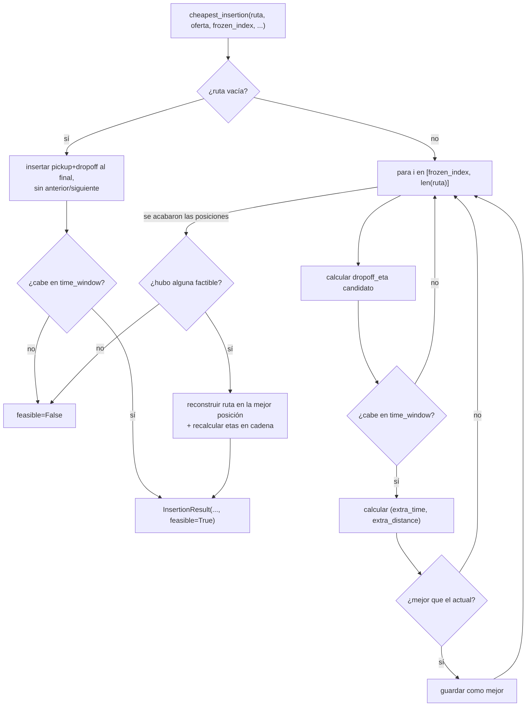

# `core/routing/greedy.py` + `tests/test_greedy.py`

## 1. Propósito

Implementa la **heurística de inserción más barata** (cheapest insertion):
dada una oferta nueva y la ruta activa del courier, calcula en qué posición
insertarla cuesta menos (tiempo/distancia extra), sin resolver el VRP
completo — es lo que permite decidir "en segundos" (ver
`docs/02_Documentacion_Tecnica.md` sección 1). Es el segundo paso del plan
(`docs/Bloque 3/01_Plan.md` sección 4), y lo que `decision.py`
(sección [`decision.md`](./decision.md)) usa para saber cuánto le costaría
al courier aceptar una oferta antes de decidir.

## 2. Por qué la firma cambió respecto al stub original

El stub original era:

```python
def cheapest_insertion(current_route, offer, frozen_index) -> InsertionResult
```

Pero `RouteStop` (en `core/models.py`) solo guarda `offer_id` y `kind`
(`"pickup"`/`"dropoff"`) — **no** guarda coordenadas. Para calcular el costo
de insertar algo "entre" dos paradas existentes hace falta saber dónde están
esas paradas, y la única forma de averiguarlo es buscar el `Offer` original
por `offer_id`. El stub tampoco recibía ninguna fuente de distancias.

Por eso la firma final agrega dos parámetros, documentados explícitamente en
el docstring del módulo:

- **`accepted_offers: dict[str, Offer]`** — la mochila actual
  (`{o.id: o for o in snapshot.backpack}`), para resolver la ubicación de
  cada `RouteStop` ya presente en `current_route`.
- **`distance_provider: DistanceProvider`** — el `Protocol` de
  [`distance_provider.md`](./distance_provider.md); hoy se le pasa
  `EuclideanDistanceProvider()`.

Y `InsertionResult` ganó un campo `feasible: bool = True`: si ninguna
posición respeta la ventana de tiempo de la oferta, la función devuelve
`feasible=False, new_route=None` en vez de lanzar una excepción — quien
decide qué hacer con una oferta no insertable es `decision.py`, no esta
función (separación de "calcular costo" vs. "decidir").

## 3. Pseudocódigo

```
función cheapest_insertion(ruta, oferta, frozen_index, ofertas_aceptadas, proveedor_distancias):

    si ruta esta vacia:
        pickup_eta = oferta.received_at
        dropoff_eta = pickup_eta + tiempo(oferta.pickup, oferta.dropoff)
        si dropoff_eta no cabe en oferta.time_window:
            devolver (no factible)
        devolver ruta_nueva = [pickup, dropoff], costo = tiempo(pickup, dropoff)

    mejor = ninguno

    para cada posicion i desde frozen_index hasta len(ruta):
        anterior = ruta[i-1] si i > 0 sino ninguno
        siguiente = ruta[i] si i < len(ruta) sino ninguno

        calcular dropoff_eta de insertar aqui
        si no cabe en oferta.time_window: continuar con la siguiente posicion

        costo_extra_tiempo = tiempo(anterior, pickup) + tiempo(pickup, dropoff) + tiempo(dropoff, siguiente)
                             - tiempo(anterior, siguiente)   # se resta el tramo que se reemplaza
        costo_extra_distancia = igual pero en distancia

        si (costo_extra_tiempo, costo_extra_distancia) < mejor:
            mejor = (costo_extra_tiempo, costo_extra_distancia, i)

    si no hay mejor:
        devolver (no factible)

    construir ruta_nueva insertando en la posicion `i` de `mejor`
    recalcular en cadena las etas de las paradas posteriores a la insercion

    devolver (costo de mejor, ruta_nueva)
```

## 4. Desglose de código

### `InsertionResult`

```python
@dataclass
class InsertionResult:
    extra_distance: float
    extra_time: float
    new_route: list[RouteStop] | None
    feasible: bool = True
```

Los tres primeros campos son el contrato original sin cambios de nombre ni
de tipo (salvo que `new_route` ahora acepta `None`). `feasible` es el único
campo agregado.

### `_location_of` — resolver coordenadas de una parada existente

```python
def _location_of(stop, accepted_offers):
    offer = accepted_offers[stop.offer_id]
    return offer.pickup if stop.kind == "pickup" else offer.dropoff
```

Traduce un `RouteStop` (que solo sabe "soy el pickup/dropoff de la oferta
X") a una coordenada real, usando el diccionario de ofertas aceptadas.

### `_pickup_dropoff_eta` — a qué hora llegaría el courier

```python
def _pickup_dropoff_eta(offer, prev_stop, prev_location, distance_provider):
    if prev_stop is None:
        pickup_eta = offer.received_at
    else:
        pickup_eta = max(
            offer.received_at,
            prev_stop.eta + distance_provider.travel_time(prev_location, offer.pickup),
        )
    dropoff_eta = pickup_eta + distance_provider.travel_time(offer.pickup, offer.dropoff)
    return pickup_eta, dropoff_eta
```

- Si no hay parada anterior (inserción al inicio de una ruta vacía), el
  pickup ocurre en cuanto llega la oferta (`offer.received_at`).
- Si sí hay parada anterior, el pickup ocurre cuando el courier termina esa
  parada más lo que tarda en llegar al nuevo pickup.
- **`max(offer.received_at, ...)`** es un candado explícito contra un caso
  físicamente imposible: si `prev_stop.eta` fuera anterior a que la oferta
  siquiera existiera, el cálculo daría un pickup "antes de que llegara el
  pedido". Esto puede pasar porque las etas de la ruta se calcularon en un
  momento anterior de la simulación y no se recalculan solas con el paso
  del reloj (eso es responsabilidad de otro bloque) — este `max` es una
  salvaguarda documentada, no una corrección de un bug real observado.

### `_insertion_cost` — costo marginal de tiempo y distancia

```python
def _insertion_cost(offer, prev_location, next_location, distance_provider):
    extra_time = distance_provider.travel_time(offer.pickup, offer.dropoff)
    extra_distance = distance_provider.travel_distance(offer.pickup, offer.dropoff)

    if prev_location is not None:
        extra_time += distance_provider.travel_time(prev_location, offer.pickup)
        extra_distance += distance_provider.travel_distance(prev_location, offer.pickup)

    if next_location is not None:
        extra_time += distance_provider.travel_time(offer.dropoff, next_location)
        extra_distance += distance_provider.travel_distance(offer.dropoff, next_location)

    if prev_location is not None and next_location is not None:
        extra_time -= distance_provider.travel_time(prev_location, next_location)
        extra_distance -= distance_provider.travel_distance(prev_location, next_location)

    return extra_time, extra_distance
```

Esta es la fórmula central del algoritmo cheapest insertion:
`costo = (anterior→pickup) + (pickup→dropoff) + (dropoff→siguiente) - (anterior→siguiente)`.
El último término se resta **solo** si existen tanto `prev_location` como
`next_location` — si se inserta al inicio o al final de la ruta, ese tramo
directo nunca existió, así que no hay nada que restar (si se restara por
error ahí, el costo daría negativo o incorrecto).

### `_build_route_with_insertion` — construir la ruta final y su cadena de etas

```python
def _build_route_with_insertion(current_route, offer, index, accepted_offers, distance_provider):
    prev_stop = current_route[index - 1] if index > 0 else None
    prev_location = _location_of(prev_stop, accepted_offers) if prev_stop else None
    pickup_eta, dropoff_eta = _pickup_dropoff_eta(offer, prev_stop, prev_location, distance_provider)

    new_route = current_route[:index] + [pickup_stop, dropoff_stop] + current_route[index:]

    # las paradas despues del punto de insercion se recalculan en cadena
    for k in range(index + 2, len(new_route)):
        ...
```

Solo se llama **una vez**, después de que ya se decidió cuál es la mejor
posición (no en cada iteración del bucle de búsqueda) — así el algoritmo
completo sigue siendo O(n): la búsqueda evalúa cada posición en O(1) usando
`_insertion_cost`, y solo al final se paga el costo de reconstruir la ruta
completa.

El `for` final es necesario porque insertar una oferta en medio de la ruta
**retrasa** (o adelanta) a todas las paradas que venían después — sus `eta`
ya no son válidas y hay que recalcularlas en cadena, una tras otra, usando
la ubicación y hora de la parada anterior en la nueva ruta.

### `cheapest_insertion` — orquesta todo lo anterior

```python
def cheapest_insertion(current_route, offer, frozen_index, accepted_offers, distance_provider):
    window_start, window_end = offer.time_window

    if not current_route:
        ...  # caso especial: no hay "anterior" ni "siguiente"

    best_index = None
    best_cost = None

    for index in range(frozen_index, len(current_route) + 1):
        ...
        cost = (extra_time, extra_distance)
        if best_cost is None or cost < best_cost:
            best_cost, best_index = cost, index

    if best_index is None:
        return InsertionResult(0.0, 0.0, None, feasible=False)

    ...
    return InsertionResult(extra_distance, extra_time, new_route, feasible=True)
```

- **`range(frozen_index, len(current_route) + 1)`** — esta es la línea que
  hace cumplir el frozen horizon: nunca se evalúa ninguna posición antes de
  `frozen_index`. La excepción de "costo marginal ~0" (regla 1 de
  `docs/01_Arquitectura.md` sección 6) **no** vive aquí — es `decision.py`
  quien decide llamar a esta función con `frozen_index=0` para explorar esa
  posibilidad (ver [`decision.md`](./decision.md) sección 4).
- **`cost = (extra_time, extra_distance)`** — comparar tuplas en Python es
  lexicográfico: primero compara `extra_time`, y solo si empatan exacto,
  compara `extra_distance`. Así se obtiene gratis la regla "elegir menor
  tiempo, empate → menor distancia" sin escribir un `if` de desempate
  explícito.
- El caso `best_index is None` ocurre cuando **ninguna** posición dentro del
  rango permitido respeta `offer.time_window` — se refleja como
  `feasible=False`, nunca como excepción.

## 5. Flujo completo



## 6. Tests (`tests/test_greedy.py`)

| Test | Qué verifica | Por qué importa |
|---|---|---|
| `test_empty_route_inserts_pickup_and_dropoff_at_the_end` | Con ruta vacía, inserta pickup+dropoff y el pickup ocurre en `offer.received_at` | Cubre el caso especial que no pasa por el bucle de búsqueda general |
| `test_chooses_cheapest_position_among_several` | Con una ruta de 2 paradas, elige insertar al final (mucho más barato) en vez de en medio, y las etas resultantes son correctas | Verifica la fórmula de costo marginal completa, no solo que "algo" se inserte |
| `test_respects_frozen_index_never_inserta_before_it` | Con `frozen_index=1`, la primera parada de la ruta nunca cambia, aunque insertar ahí sería lo más barato sin la restricción | Verifica la regla de compromiso (frozen horizon) al nivel de esta función, antes de que `decision.py` le agregue la excepción del costo ~0 |
| `test_infeasible_when_no_position_fits_time_window` | Una ventana de tiempo imposible (`0.001` min) da `feasible=False, new_route=None` | Verifica que la función reporta inviabilidad en vez de lanzar una excepción o devolver una ruta inválida |

Las coordenadas de prueba (`TEC`, `CENTRO`, `APODACA`) son las mismas zonas
reales que usan `core/simulation/engine.py` y `core/agent/demand.py`.
